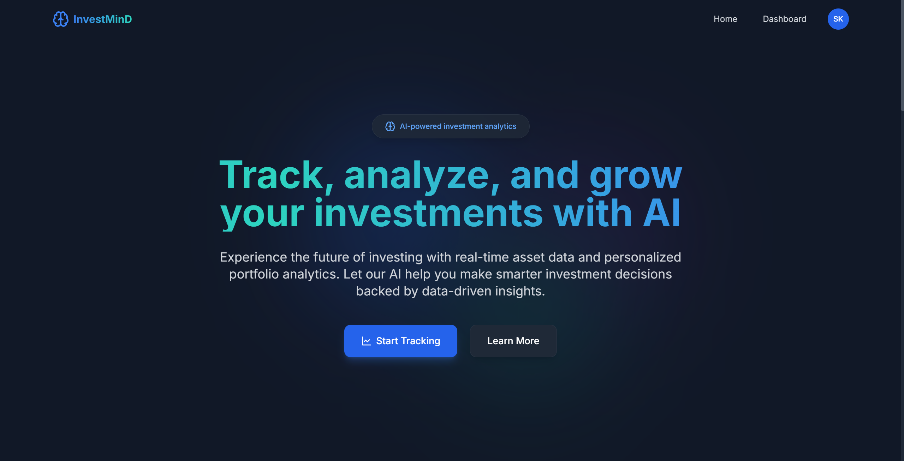
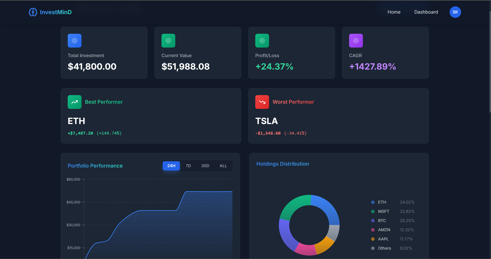

<div align="center">

# InvestMinD

### AI-Powered Smart Investment Tracker

_Track portfolios. Analyze performance. Get AI insights — in real time._

[](https://www.investmind.live)
[](./LICENSE)

---

<!-- Tech Badges -->


</div>

---

## Screenshots

| Homepage                                       | Dashboard                                        |
| ---------------------------------------------- | ------------------------------------------------ |
|  |  |

---

## Features

| Feature           | Description                                                        |
| ----------------- | ------------------------------------------------------------------ |
| **Auth**          | JWT-based login/signup with OTP email verification & Google OAuth  |
| **Portfolios**    | Create and manage multiple portfolios with real-time P&L stats     |
| **Holdings**      | Add/delete holdings with auto price updates and gain/loss tracking |
| **Transactions**  | Full buy/sell transaction log per holding                          |
| **Charts**        | Time-series performance, donut distribution, best/worst performers |
| **Symbol Search** | Fuzzy search with Fuse.js, autocomplete, and local validation      |
| **AI Insights**   | LLaMA 3.3 70B powered summaries per stock or full portfolio        |
| **Live Prices**   | Real-time pricing via Dockerized FastAPI + yfinance microservice   |
| **Export**        | Download `.xlsx` Excel reports with full formatting                |
| **Dark Mode**     | Fully responsive UI with dark mode & Framer Motion animations      |

---

## Tech Stack

| Layer         | Technologies                                                       |
| ------------- | ------------------------------------------------------------------ |
| **Frontend**  | React 18, TypeScript, Vite, Tailwind CSS, Recharts, Framer Motion  |
| **Backend**   | Node.js, Express 5, MongoDB Atlas, Mongoose, JWT, Nodemailer       |
| **AI**        | NVIDIA NIM — Meta LLaMA 3.3 70B Instruct                           |
| **Price API** | FastAPI + yfinance (Dockerized microservice)                       |
| **Auth**      | JWT, OTP via Email, Google OAuth                                   |
| **Hosting**   | DigitalOcean App Platform (backend & price API), Vercel (frontend) |
| **DevTools**  | Docker, ESLint, Prettier, GitHub Actions, Nodemon                  |

---

## Project Structure

```
InvestMinD/
├── client/
│   ├── src/
│   │   ├── components/
│   │   ├── contexts/
│   │   ├── hooks/
│   │   ├── services/
│   │   └── utils/
│   └── public/
│       └── symbols_database.json
│
└── server/
    ├── controllers/
    ├── models/
    ├── routes/
    ├── utils/
    ├── middleware/
    └── jobs/
```

---

## API Reference

All backend endpoints are prefixed with `/api`.

<details>
<summary><strong> Auth</strong></summary>

| Method | Endpoint             | Description                 |
| ------ | -------------------- | --------------------------- |
| `POST` | `/auth/signup`       | Register + send OTP         |
| `POST` | `/auth/login`        | Login with email & password |
| `POST` | `/auth/verify-email` | Verify OTP                  |
| `POST` | `/auth/resend-otp`   | Resend verification OTP     |
| `GET`  | `/auth/me`           | Get logged-in user info     |

</details>

<details>
<summary><strong> Portfolios</strong></summary>

| Method   | Endpoint                      | Description                    |
| -------- | ----------------------------- | ------------------------------ |
| `GET`    | `/portfolios`                 | Get all portfolios             |
| `POST`   | `/portfolios`                 | Create new portfolio           |
| `DELETE` | `/portfolios/:id`             | Delete a portfolio             |
| `GET`    | `/portfolios/:id/stats`       | Portfolio summary (P/L, total) |
| `GET`    | `/portfolios/:id/analytics`   | CAGR + current stats           |
| `GET`    | `/portfolios/:id/stocks`      | Asset-wise distribution        |
| `GET`    | `/portfolios/:id/best-worst`  | Best/worst performers          |
| `GET`    | `/portfolios/:id/performance` | Time-series performance data   |

</details>

<details>
<summary><strong> Holdings</strong></summary>

| Method   | Endpoint                   | Description                       |
| -------- | -------------------------- | --------------------------------- |
| `POST`   | `/portfolios/:id/holdings` | Add a holding                     |
| `GET`    | `/portfolios/:id/holdings` | Get holdings for a portfolio      |
| `GET`    | `/portfolios/:id/summary`  | Enriched summary with live prices |
| `GET`    | `/holdings/:id`            | Single holding info               |
| `DELETE` | `/holdings/:id`            | Delete a holding                  |

</details>

<details>
<summary><strong> Transactions</strong></summary>

| Method | Endpoint                     | Description             |
| ------ | ---------------------------- | ----------------------- |
| `GET`  | `/transactions/holdings/:id` | Get transaction history |

</details>

<details>
<summary><strong> AI Insights</strong></summary>

| Method | Endpoint                           | Description                      |
| ------ | ---------------------------------- | -------------------------------- |
| `GET`  | `/insight`                         | Insight for all portfolios       |
| `GET`  | `/insight/:portfolioId`            | Insight for a specific portfolio |
| `GET`  | `/ai/insight/:portfolioId/:symbol` | Insight for a single asset       |

Powered by **Meta LLaMA 3.3 70B Instruct** via NVIDIA NIM API.

</details>

<details>
<summary><strong> Prices (FastAPI Microservice)</strong></summary>

| Method | Endpoint             | Description                  |
| ------ | -------------------- | ---------------------------- |
| `GET`  | `/price?symbol=AAPL` | Get real-time price and name |

Hosted at: `https://lionfish-app-kkha4.ondigitalocean.app`

</details>

<details>
<summary><strong> Exports</strong></summary>

| Method | Endpoint                  | Description              |
| ------ | ------------------------- | ------------------------ |
| `GET`  | `/exports/portfolios/:id` | Export holdings to Excel |

</details>

---

## Getting Started

### Prerequisites

- Node.js 18+
- Python 3.9+ (for price microservice)
- MongoDB Atlas URI
- NVIDIA NIM API key → [build.nvidia.com/models](https://build.nvidia.com/models)

---

### 1. Clone the repo

```bash
git clone https://github.com/SumanKumar5/InvestMinD.git
cd InvestMinD
```

### 2. Backend

```bash
cd server
npm install
cp .env.example .env
# Fill in your environment variables (see below)
npm run dev
```

**Environment Variables (`server/.env`):**

```env
PORT=5000
MONGO_URI=your_mongodb_uri
JWT_SECRET=your_jwt_secret
NVIDIA_API_KEY=your_nvidia_nim_key
EMAIL_USER=your_email
EMAIL_PASS=your_email_password
TWELVE_API_KEY=your_12data_key
```

Or run with Docker:

```bash
docker build -t investmind-api .
docker run -p 5000:5000 investmind-api
```

### 3. FastAPI Price Microservice

```bash
cd price-api
pip install -r requirements.txt
uvicorn main:app --host 0.0.0.0 --port 8000
```

Or with Docker:

```bash
docker build -t price-service .
docker run -p 8000:8000 price-service
```

### 4. Frontend

```bash
cd client
npm install
echo "VITE_API_BASE_URL=http://localhost:5000" > .env
npm run dev
```

---

## Deployment

| Service             | Platform                                                                        |
| ------------------- | ------------------------------------------------------------------------------- |
| Frontend            | [Vercel](https://vercel.com)                                                    |
| Backend + Price API | [DigitalOcean App Platform](https://www.digitalocean.com/products/app-platform) |
| Database            | [MongoDB Atlas](https://www.mongodb.com/atlas)                                  |

---

## License

This project is licensed under the [MIT License](./LICENSE).  
Built with ❤️ by [Suman Kumar](https://github.com/SumanKumar5)

---

## Acknowledgements

- [yfinance](https://github.com/ranaroussi/yfinance) - stock & crypto price data
- [NVIDIA NIM](https://build.nvidia.com/models) - free hosted LLM inference
- [Meta LLaMA](https://llama.meta.com/) - open-source LLM powering AI insights
- [Fuse.js](https://fusejs.io/) - fuzzy search for symbol autocomplete
- [DigitalOcean](https://www.digitalocean.com/) & [Vercel](https://vercel.com/) - hosting
